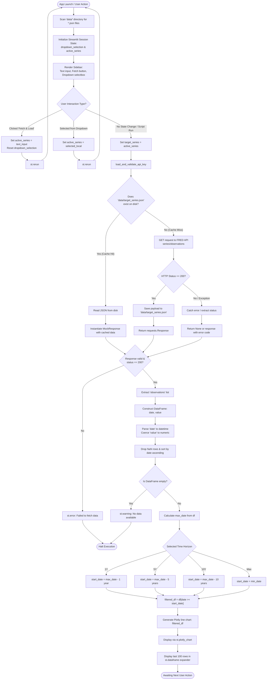

```mermaid
flowchart TD
    %% Initial Entry & Discovery
    Start([App Launch / User Action]) --> ScanCache["Scan 'data/' directory for *.json files"]
    ScanCache --> InitState["Initialize Streamlit Session State:<br/>dropdown_selection & active_series"]
    InitState --> RenderSidebar["Render Sidebar:<br/>Text input, Fetch button, Dropdown selectbox"]

    %% Input Decision
    RenderSidebar --> CheckInput{User Interaction Type?}
    
    CheckInput -- "Clicked 'Fetch & Load'" --> HandleFetch["Set active_series = text_input<br/>Reset dropdown_selection"]
    HandleFetch --> TriggerRerun1[st.rerun] --> Start
    
    CheckInput -- "Selected from Dropdown" --> HandleDropdown["Set active_series = selected_local"]
    HandleDropdown --> TriggerRerun2[st.rerun] --> Start
    
    CheckInput -- "No State Change / Script Run" --> ProceedLoad["Set target_series = active_series"]

    %% Data Acquisition Logic (data_loader.py)
    ProceedLoad --> CheckAPIKey[load_and_validate_api_key]
    CheckAPIKey --> CheckLocalFile{"Does 'data/target_series.json'<br/>exist on disk?"}

    %% Cache Hit Path
    CheckLocalFile -- Yes (Cache Hit) --> ReadLocal["Read JSON from disk"]
    ReadLocal --> WrapMock["Instantiate MockResponse with cached data"]
    WrapMock --> EvaluateResponse

    %% Cache Miss / Remote API Path
    CheckLocalFile -- No (Cache Miss) --> SendAPI["GET request to FRED API<br/>series/observations"]
    SendAPI --> CheckHTTP{"HTTP Status == 200?"}
    
    CheckHTTP -- Yes --> WriteDisk["Save payload to 'data/target_series.json'"]
    WriteDisk --> ReturnHTTP["Return requests.Response"]
    ReturnHTTP --> EvaluateResponse

    CheckHTTP -- No / Exception --> HandleAPIFail["Catch error / extract status"]
    HandleAPIFail --> ReturnFail["Return None or response with error code"]
    ReturnFail --> EvaluateResponse

    %% Response Evaluation in dashboard.py
    EvaluateResponse{"Response valid &<br/>status == 200?"}
    
    EvaluateResponse -- No --> ShowErrorUI["st.error: Failed to fetch data"]
    ShowErrorUI --> Stop([Halt Execution])

    EvaluateResponse -- Yes --> ExtractJSON["Extract 'observations' list"]
    
    %% Data Sanitization & Cleaning
    ExtractJSON --> BuildDF["Construct DataFrame: date, value"]
    BuildDF --> TypeCast["Parse 'date' to datetime<br/>Coerce 'value' to numeric"]
    TypeCast --> CleanDF["Drop NaN rows & sort by date ascending"]
    
    CleanDF --> CheckDFEmpty{"Is DataFrame empty?"}
    CheckDFEmpty -- Yes --> ShowWarningUI["st.warning: No data available"]
    ShowWarningUI --> Stop

    %% Horizon Filtering & Visualization
    CheckDFEmpty -- No --> GetMaxDate["Calculate max_date from df"]
    GetMaxDate --> EvalHorizon{Selected Time Horizon}

    EvalHorizon -- "1Y" --> Set1Y["start_date = max_date - 1 year"]
    EvalHorizon -- "5Y" --> Set5Y["start_date = max_date - 5 years"]
    EvalHorizon -- "10Y" --> Set10Y["start_date = max_date - 10 years"]
    EvalHorizon -- "Max" --> SetMax["start_date = min_date"]

    Set1Y --> SliceDF["filtered_df = df[date >= start_date]"]
    Set5Y --> SliceDF
    Set10Y --> SliceDF
    SetMax --> SliceDF

    %% Render Views
    SliceDF --> BuildPlot["Generate Plotly line chart: filtered_df"]
    BuildPlot --> RenderChart["Display via st.plotly_chart"]
    RenderChart --> RenderTable["Display last 100 rows in st.dataframe expander"]
    RenderTable --> EndNode([Awaiting Next User Action])
```