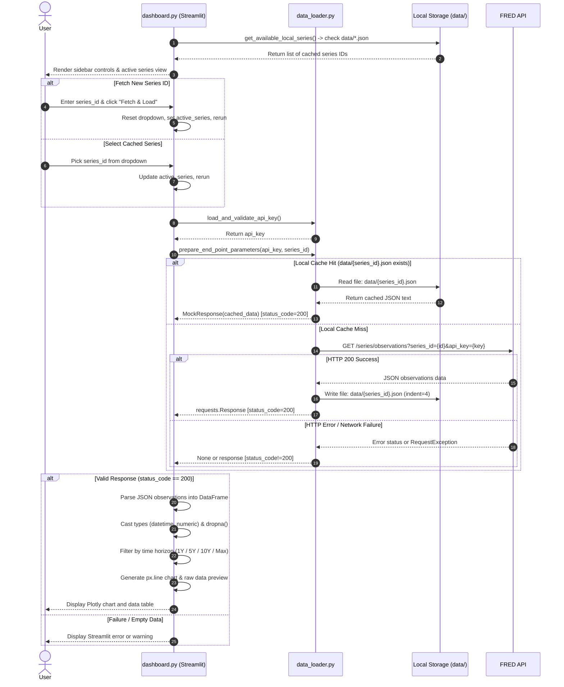

```mermaid
sequenceDiagram
    autonumber
    actor User
    participant UI as dashboard.py (Streamlit)
    participant Loader as data_loader.py
    participant Disk as Local Storage (data/)
    participant FRED as FRED API

    %% Session Setup & Local Scanning
    UI->>Disk: get_available_local_series() -> check data/*.json
    Disk-->>UI: Return list of cached series IDs
    UI-->>User: Render sidebar controls & active series view

    %% User Interaction Flow
    alt Fetch New Series ID
        User->>UI: Enter series_id & click "Fetch & Load"
        UI->>UI: Reset dropdown, set active_series, rerun
    else Select Cached Series
        User->>UI: Pick series_id from dropdown
        UI->>UI: Update active_series, rerun
    end

    %% Data Acquisition Phase
    UI->>Loader: load_and_validate_api_key()
    Loader-->>UI: Return api_key
    UI->>Loader: prepare_end_point_parameters(api_key, series_id)

    alt Local Cache Hit (data/{series_id}.json exists)
        Loader->>Disk: Read file: data/{series_id}.json
        Disk-->>Loader: Return cached JSON text
        Loader-->>UI: MockResponse(cached_data) [status_code=200]
    else Local Cache Miss
        Loader->>FRED: GET /series/observations?series_id={id}&api_key={key}
        alt HTTP 200 Success
            FRED-->>Loader: JSON observations data
            Loader->>Disk: Write file: data/{series_id}.json (indent=4)
            Loader-->>UI: requests.Response [status_code=200]
        else HTTP Error / Network Failure
            FRED-->>Loader: Error status or RequestException
            Loader-->>UI: None or response [status_code!=200]
        end
    end

    %% Data Sanitization & Visualization Phase
    alt Valid Response (status_code == 200)
        UI->>UI: Parse JSON observations into DataFrame
        UI->>UI: Cast types (datetime, numeric) & dropna()
        UI->>UI: Filter by time horizon (1Y / 5Y / 10Y / Max)
        UI->>UI: Generate px.line chart & raw data preview
        UI-->>User: Display Plotly chart and data table
    else Failure / Empty Data
        UI-->>User: Display Streamlit error or warning
    end
```